# 📘 Control App — Complete User Manual & System Reference

> **Version 2.0** | Last Updated: April 2026 | Proprietary & Confidential — Virtusa

>  **Interactive Documentation Site:** [docs/index.html](index.html) — Full visual site with live Mermaid diagrams, all role guides, API reference, and setup instructions. Open in your browser for the best experience.

---

##  Table of Contents

| # | Section |
|---|---------|
|  | [**Interactive Documentation Site**](index.html) |
| 1 | [System Architecture Overview](#1-system-architecture-overview) |
| 2 | [Data Model — Entity Relationship Diagram](#2-data-model--entity-relationship-diagram) |
| 3 | [Class Diagram](#3-class-diagram) |
| 4 | [Use Case Diagrams](#4-use-case-diagrams) |
| 5 | [System Workflow Diagrams](#5-system-workflow-diagrams) |
| 6 | [Getting Started — Registration & Login](#6-getting-started--registration--login) |
| 7 | [User Roles & Permissions](#7-user-roles--permissions) |
| 8 | [Navigation Bar & Global UI](#8-navigation-bar--global-ui) |
| 9 | [Notification Center](#9-notification-center) |
| 10 | [Profile & Account Settings](#10-profile--account-settings) |
| 11 | [Super Admin Dashboard](#11-super-admin-dashboard) |
| 12 | [Command Center — Role-Based Dashboards](#12-command-center--role-based-dashboards) |
| 13 | [Team & Employee Administration](#13-team--employee-administration) |
| 14 | [System Controls Board — Ops Room](#14-system-controls-board--ops-room) |
| 15 | [Daily Progress Tracking](#15-daily-progress-tracking) |
| 16 | [QA Testing & Defect Management](#16-qa-testing--defect-management) |
| 17 | [RC Matrix — Root Cause Analysis](#17-rc-matrix--root-cause-analysis) |
| 18 | [Release Hub & Roadmaps](#18-release-hub--roadmaps) |
| 19 | [Activity & Audit Logging](#19-activity--audit-logging) |
| 20 | [Control Types Management](#20-control-types-management) |
| 21 | [Security & Technical Reference](#21-security--technical-reference) |
| 22 | [Troubleshooting](#22-troubleshooting) |

---

## 1. System Architecture Overview

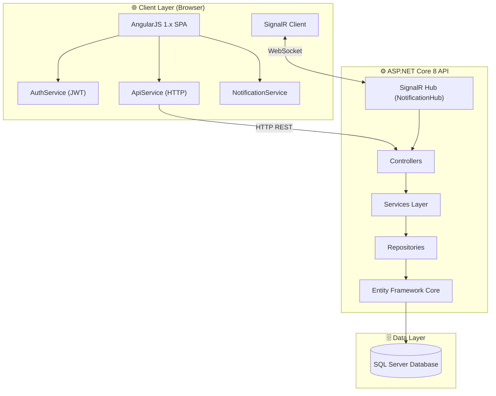

### Technology Stack

| Layer | Technology |
|-------|-----------|
| **Frontend** | AngularJS 1.x, Bootstrap 5, Chart.js, SweetAlert2 |
| **Backend** | ASP.NET Core 8, C#, Entity Framework Core |
| **Real-time** | SignalR (WebSocket-based push notifications) |
| **Database** | SQL Server |
| **Auth** | JWT (JSON Web Tokens) + BCrypt password hashing |
| **UI Icons** | Font Awesome 6 |

---

## 2. Data Model — Entity Relationship Diagram

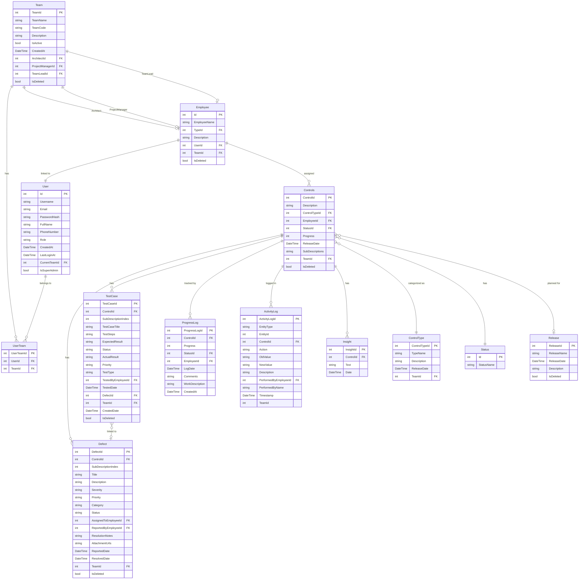

---

## 3. Class Diagram

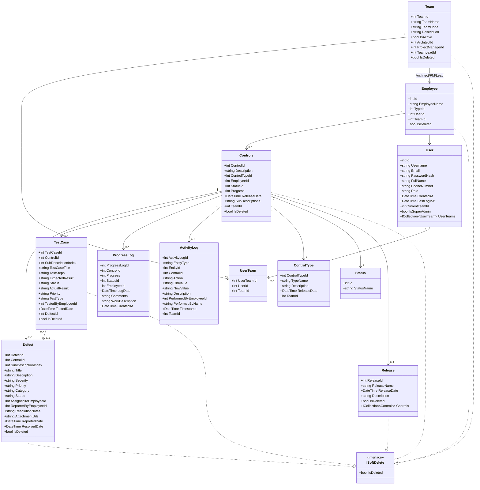

---

## 4. Use Case Diagrams

### 4.1 System-Wide Use Case Overview

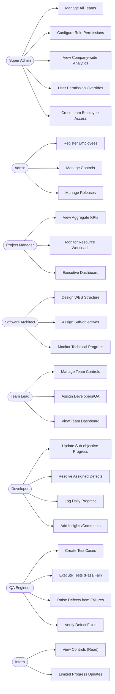

### 4.2 Authentication Use Cases

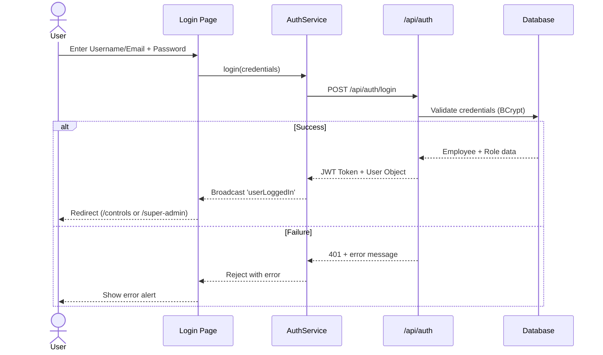

### 4.3 Defect Lifecycle Use Case

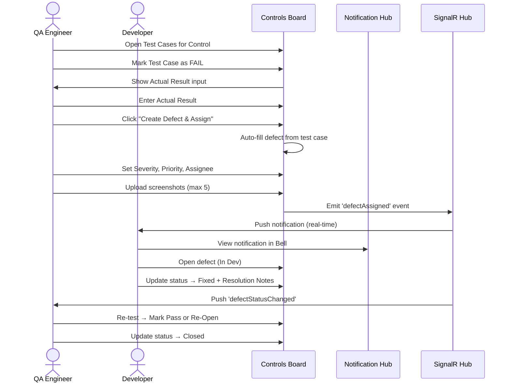

### 4.4 Control Progression Flow

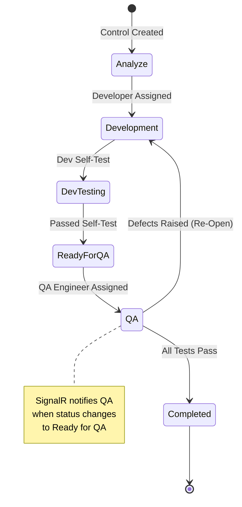

---

## 5. System Workflow Diagrams

### 5.1 Overall System Workflow

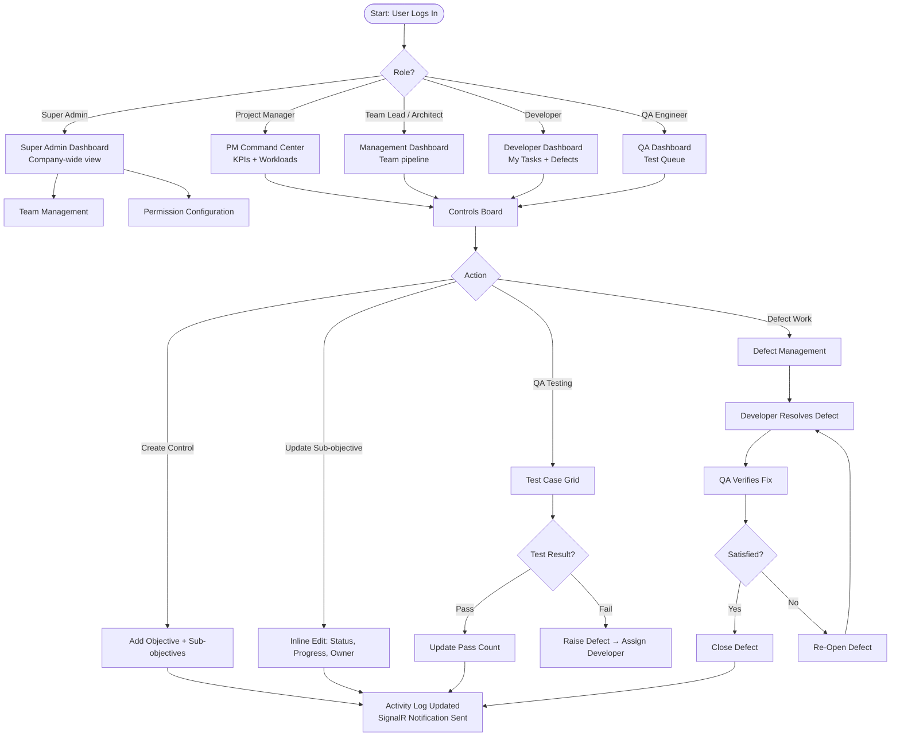

### 5.2 RC Matrix Workflow

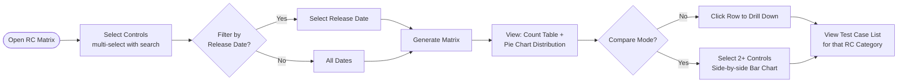

### 5.3 Daily Progress Tracking Workflow

```mermaid
flowchart TD
    A([Open Daily Progress]) --> B[Select Date\nDefaults to Today]
    B --> C[API loads /api/progresslog/daily-summary]
    C --> D{Has Logs?}
    D -->|Yes| E[Show Summary Card:\nTotal Objectives, Updated Today,\nAvg Progress%, Daily Update Rate%]
    D -->|No| F[Show Empty State]
    E --> G[Display Logs Table:\nObjective, Employee, Status,\nCircular Progress, Work Description,\nComments, Time]
    G --> H{Show Weekly?}
    H -->|Yes| I[/api/progresslog/weekly-summary\nMon–Sun cards]
    H -->|No| J[Stay on Daily View]
    I --> K[Each day card:\nUpdates count + Avg Progress%]
```

---

## 6. Getting Started — Registration & Login

###  Login

| Field | Notes |
|-------|-------|
| **Username or Email** | Either format accepted |
| **Password** | BCrypt-verified; minimum 6 characters |
| ** Show/Hide** | Eye icon toggles password visibility |

**Steps:**
1. Navigate to the application URL.
2. Enter your credentials and click **Login**.
3. On success, you are redirected automatically:
   - **Super Admin** → `/super-admin`
   - **All other roles** → `/controls`
4. On failure, an inline red alert shows the error message.

> The login button shows a **spinner** while the API is validating — do not double-click.

---

###  Registration

> Only **Admin** users see the Register link. Others see: *"Contact Admin or Project Manager to register"*.

Fill in the registration form:

| Field | Required | Validation |
|-------|----------|-----------|
| **Username** | ✅ | Min 3 characters |
| **Email** | ✅ | Valid email format enforced |
| **Full Name** | ❌ | Display name (optional) |
| **Role** | ✅ | Admin / Software Architecture / Team Lead / Developer / QA Engineer / Intern |
| **Password** | ✅ | Min 6 characters; 👁️ toggle available |

On success → automatically logged in and redirected to `/controls`.

---

## 7. User Roles & Permissions

> **v2.0 Update:** Three new roles have been added — **Release Manager**, **Security Auditor**, and **Business Analyst** — bringing the total to **11 roles**. See the [Interactive Documentation Site](index.html#roles) for the visual role matrix.

### All Roles

| Role | Access Level | Primary Responsibilities |
|------|-------------|--------------------------|
| **Super Admin** |  System-wide | Manage all teams, configure role permissions, company-wide analytics |
| **Admin** |  Team-scope | Register employees, manage controls, releases |
| **Project Manager** |  Executive | View aggregate KPIs, resource workloads, executive dashboard |
| **Software Architect** |  Technical Lead | Design WBS, assign developers, monitor flow |
| **Team Lead** |  Operational | Assign controls, manage sub-objectives, monitor team |
| **Developer** |  Task Execution | Update sub-objectives, resolve defects, log progress |
| **QA Engineer** |  Quality | Create/execute test cases, raise defects, verify fixes |
| **Intern** |  Restricted | View and limited execution based on team config |
| **Release Manager**  NEW |  Release Pipeline | Manage releases, Release Hub calendar, deployment planning, generate reports |
| **Security Auditor**  NEW |  Read-only Audit | View all activity logs across all teams, audit defect/test history, export compliance reports |
| **Business Analyst**  NEW |  Requirements | Add controls from requirement specs, edit sub-objectives, add insights, view dashboards and RC Matrix |

###  Release Manager (New in v2.0)

The **Release Manager** role is dedicated to controlling the software release pipeline.

**Capabilities:**
- Create, edit, and delete Release records
- View the full Release Hub calendar across teams
- Browse all Controls to assess release readiness
- Generate release progress reports
- View Activity Logs for audit purposes

**Restrictions:** Cannot create/edit controls directly, cannot report defects or manage test cases, cannot manage employees or team membership.

###  Security Auditor (New in v2.0)

The **Security Auditor** role provides compliance oversight across the entire application.

**Capabilities:**
- Read-only access to all controls, defects, test cases, and progress logs
- Full access to Activity Logs across all teams
- Export audit trails for compliance reporting
- View the permission matrix (read-only)

**Restrictions:** Cannot create, edit, or delete any records. Strictly read-only. Cannot access the Super Admin Panel.

###  Business Analyst (New in v2.0)

The **Business Analyst** role bridges business requirements and technical delivery.

**Capabilities:**
- Create new Controls and Sub-Objectives from requirement specifications
- Edit Sub-Objectives (description, owner, dates)
- Add Insights/Comments to sub-objectives
- View role-based dashboards with KPI data
- Access and consume RC Matrix reports

**Restrictions:** Cannot report defects, create test cases, manage team membership, or access the Super Admin Panel.

### Role Access Matrix

| Permission | Super Admin | Admin | Architect | Team Lead | Proj Mgr | Developer | QA Eng | Intern | Release Mgr ✦ | Sec. Auditor ✦ | Biz Analyst ✦ |
|-----------|:-----------:|:-----:|:---------:|:---------:|:--------:|:---------:|:------:|:------:|:-----------:|:-------------:|:------------:|
| Add Controls | ✅ | ✅ | ✅ | ✅ | ❌ | ✅ | ✅ | ✅ | ❌ | ❌ | ✅ |
| Edit Controls | ✅ | ✅ | ✅ | ✅ | ❌ | ❌ | ❌ | ❌ | ❌ | ❌ | ❌ |
| Delete Controls | ✅ | ✅ | ✅ | ✅ | ❌ | ❌ | ❌ | ❌ | ❌ | ❌ | ❌ |
| Add Employees | ✅ | ✅ | ❌ | ❌ | ✅ | ❌ | ❌ | ❌ | ❌ | ❌ | ❌ |
| Edit Employees | ✅ | ✅ | ✅ | ✅ | ❌ | ❌ | ❌ | ❌ | ❌ | ❌ | ❌ |
| Delete Employees | ✅ | ✅ | ✅ | ✅ | ❌ | ❌ | ❌ | ❌ | ❌ | ❌ | ❌ |
| Mark Progress | ✅ | ✅ | ✅ | ✅ | ❌ | ✅ | ❌ | ✅ | ❌ | ❌ | ❌ |
| Add Comments | ✅ | ✅ | ✅ | ✅ | ❌ | ❌ | ❌ | ❌ | ❌ | ❌ | ✅ |
| Edit Sub-Objectives | ✅ | ✅ | ✅ | ✅ | ❌ | ✅ | ✅ | ✅ | ❌ | ❌ | ✅ |
| Add Test Cases | ✅ | ✅ | ✅ | ❌ | ❌ | ❌ | ✅ | ❌ | ❌ | ❌ | ❌ |
| Report Defects | ✅ | ✅ | ✅ | ❌ | ❌ | ❌ | ✅ | ❌ | ❌ | ❌ | ❌ |
| Manage Teams | ✅ | ✅ | ❌ | ❌ | ❌ | ❌ | ❌ | ❌ | ❌ | ❌ | ❌ |
| Manage Releases | ✅ | ✅ | ❌ | ❌ | ❌ | ❌ | ❌ | ❌ | ✅ | ❌ | ❌ |
| View Activity Logs | ✅ | ✅ | ✅ | ✅ | ✅ | ✅ | ✅ | ❌ | ✅ | ✅ | ❌ |
| Export Audit Reports | ✅ | ✅ | ❌ | ❌ | ❌ | ❌ | ❌ | ❌ | ✅ | ✅ | ❌ |
| Super Admin Panel | ✅ | ❌ | ❌ | ❌ | ❌ | ❌ | ❌ | ❌ | ❌ | ❌ | ❌ |

> **Note:** Super Admin permissions are **always full** and cannot be overridden.
> ✦ New roles added in v2.0

### Role Dashboard Views

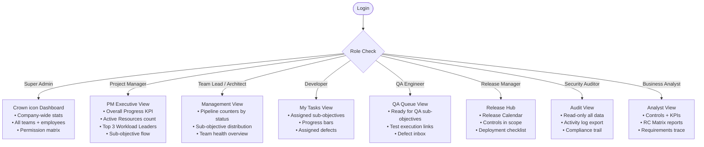

---

## 8. Navigation Bar & Global UI

The sticky navigation bar contains (left to right):

| Element | Visible To | Description |
|---------|-----------|-------------|
| ** Logo** | All | "Control Management System" — links to home |
| **Username + Role Badge** | All (desktop) | Shows your name and role in a coloured badge |
| **Avatar Circle** | All (mobile) | First letter of username, tap to see name |
| **Team Switcher** | Multi-team users | Dropdown to switch active team context |
| ** Bell** | Authenticated | Opens Notification Panel with unread count |
| ** Profile** | Authenticated | Navigates to `/profile` |
| ** Logout** | Authenticated | SweetAlert2 confirmation before signing out |

### Team Switcher

If assigned to **multiple teams**, a dropdown appears:

```
┌─────────────────────────────┐
│ 🌐 All My Teams             │
│ ─────────────────────────── │
│ ✅ Team Alpha (active)       │
│    Team Beta                │
│    Team Gamma               │
│ ─────────────────────────── │
│ ⚙️  Manage Teams  (Admin+)  │
└─────────────────────────────┘
```

> Switching teams **instantly refreshes** all data on the current page.

### Logout Confirmation

Shows a SweetAlert2 modal:
- **"Yes, Logout!"** (red) — clears JWT, redirects to `/login`
- **"Cancel"** (blue) — dismisses, stays on current page

---

## 9. Notification Center

Click the ** Bell icon** to open the panel. The badge shows total unread (notifications + active defects).

### Tab 1: Notifications

Real-time push notifications via **SignalR** (no page refresh needed):

| Event | Icon | Trigger |
|-------|------|---------|
| **Defect Assigned** | 🐛 Red | A QA engineer assigned a defect to you |
| **Defect Status Changed** | 🐛 Red | A defect you're involved with changed state |
| **Test Case Failed** | 🧪 Yellow | A test case you're linked to failed |
| **QA Assigned** | ℹ️ Blue | You were designated QA for a sub-objective |

**Features:**
- **Unread indicator**: Blue dot + bold text
- **Time ago**: "Just now", "5 min ago", "2 hr ago", "3 days ago"
- **Clickable**: Defect notifications navigate to that defect and highlight it
- **Clear All**: Removes all of today's notifications
- **Per-user storage**: Stored in browser `localStorage` keyed by username
- **Today only**: Notifications older than today are auto-filtered out; maximum 50 kept

### Tab 2: My Defects

A personal defect inbox showing all defects **assigned to the current user** with status ≠ Closed and ≠ Duplicate:

| Field | Description |
|-------|-------------|
| **Severity colour dot** | 🔴 Critical, 🟡 High, 🔵 Medium, 🟢 Low |
| **Title** | Defect name (truncated at 60 chars) |
| **Status badge** | Open (red), In Dev (yellow), Fixed (green), Re-Open (red) |
| **Linked control** | Which control this defect belongs to |
| **Time ago** | Age of the defect report |

> Clicking a defect navigates to the Controls Board and opens the defect detail panel.

---

## 10. Profile & Account Settings

Access via **⚙️ Profile** button → `/profile`

The top panel shows your current account: **Username, Email, Phone Number, Role badge**.

###  Change Email

1. Enter **New Email Address** — validated in real-time (turns red if invalid format).
2. Enter **Current Password** to confirm identity (👁️ eye icon toggle available).
3. Click **Update Email**.
4. On success: session is updated, then you are **auto logged out after 2 seconds** to re-login with the new email.

> The new email becomes both your email *and* username for future logins.

###  Change Phone Number

1. Enter phone number with country code, e.g. `+94 77 123 4567`.
2. Maximum **20 characters**.
3. Click **Update Phone Number**.
4. No logout required — number is updated in-session immediately.

###  Change Password

| Field | Validation |
|-------|-----------|
| **Current Password** | Required; 👁️ toggle |
| **New Password** | Min 6 chars; field turns red if too short |
| **Confirm Password** | Must match; shows "Passwords do not match" if different |

The **Save** button is disabled until all validations pass. On success → **auto logged out after 2 seconds**.

---

## 11. Super Admin Dashboard

>  **Exclusively for Super Admin accounts.** All other roles are redirected away with an access denied alert.

Route: `/super-admin`

###  Company-Wide Stat Cards

Five gradient metric cards at the top:

| Card | Gradient | Metric | Sub-info |
|------|----------|--------|----------|
| **Teams** | 🟣 Indigo | Total team count | Active teams count |
| **Employees** | 🟢 Green | Unique employees | "across all teams" |
| **Controls** | 🔵 Blue | Total controls | Completed controls count |
| **Avg Progress** | 🟡 Amber | Company-wide avg % | "company-wide" |
| **Control Types** | 🟣 Purple | Active category count | "active categories" |

###  Per-Team Cards

Each team renders a gradient card showing:
- **Team Name** + Team Code badge
- **Active / Inactive** status pill
- **3 stat columns**: Members, Controls, Avg Progress %
- **Progress bar** showing team health
- **Role breakdown** pills (up to 4 top roles, e.g. "Developer: 3", "QA: 2")
- **Buttons**: `Controls` | `Members`

###  Quick Actions Bar

| Button | What it does |
|--------|-------------|
| **+ Create New Team** | Opens team creation modal |
| **Manage Teams** | Navigates to `/teams` page |
| **Assign Employees** | Opens employee → team assignment workflow |

###  Role Permissions Matrix

A full **9 permission × 8 role** toggle matrix:

| Permission | Description |
|-----------|-------------|
| Add Controls | Create new system controls |
| Edit Controls | Modify existing control details |
| Delete Controls | Permanently remove controls |
| Add Employees | Register new team members |
| Edit Employees | Update employee information |
| Delete Employees | Remove employee records |
| Mark Progress | Update progress percentages |
| Add Comments | Post insights on sub-objectives |
| Edit Sub-Objectives | Inline-edit sub-objective fields |

- Admin column is **always checked** and cannot be unchecked
- **Save Changes** → persists to `localStorage`; members must **re-login** for effect
- **Reset** → reverts all to system defaults

###  User Permission Overrides

Override specific permissions **per individual employee** beyond their role:

1. Filter the employee list by team using the dropdown.
2. Click **⚙️** on any employee card to open their override modal.
3. Each permission shows: toggle + *"Role default: ✓ / ✗"* for context.
4. **Save Overrides** — stored in `localStorage` per `employeeId_teamId` key.
5. **🗑️ Reset** — reverts to role defaults for that employee.

Employees with active overrides display **green pills** showing their extra permissions.

###  Team Access Management

Assign employees to **additional teams** beyond their primary team:

1. Click **➕** (user-plus icon) on any employee card.
2. Modal shows all teams with toggle switches.
3. Primary team is **always checked** (locked).
4. Toggle additional teams → API call is made immediately (`POST/DELETE /api/teams/{teamId}/members/{userId}`).
5. Employees must **re-login** to see new teams in the Team Switcher.

---

## 12. Command Center — Role-Based Dashboards

###  Project Manager — Executive View

```
┌──────────────────┬──────────────────┐
│  Overall Progress│  Active Resources│
│      73%         │      12          │
└──────────────────┴──────────────────┘
┌────────────────────────────────────┐
│  Sub-Objective Distribution Flow   │
│  Analyze:5 | Dev:12 | QA:6 |      │
│  Ready:3 | Completed:18            │
└────────────────────────────────────┘
┌────────────────────────────────────┐
│   Top Workloads Leaderboard     │
│  1. John Smith    ████████ 78%    │
│  2. Jane Doe      ██████   65%    │
│  3. Bob Chen      █████    54%    │
└────────────────────────────────────┘
```

###  Team Lead / Architect — Management View

Pipeline status counters for the current team:

| Status | Description |
|--------|-------------|
| **Analyze** | Sub-objectives in planning phase |
| **Development** | Actively being coded |
| **QA** | Under quality testing |
| **Ready for QA** | Dev complete, awaiting QA start |
| **Completed** | Done ✅ |

###  Developer — My Tasks

Table of sub-objectives assigned to the logged-in developer:
- Control name → Sub-objective name
- Current status badge
- Progress bar
- Deadline date
- Inline progress update button

###  QA Engineer — Verification Queue

Filtered list of sub-objectives with status **"Ready for QA"**:
- Control and sub-objective name
- **Open Test Cases** button → jumps to test grid
- **+ New Defect** quick button
- Pass/Fail count summary

###  Release Hub Calendar Widget

- Monthly calendar view embedded in the dashboard
- Dots on dates that have planned releases
- Click a dot/date → see controls + progress for that release
- Navigate previous months to review historical releases

---

## 13. Team & Employee Administration

###  Team Management (`/teams`)

| Action | Who Can | Description |
|--------|---------|-------------|
| **Create Team** | Admin, Super Admin | Name, Code (short ID), Description |
| **Edit Team** | Admin, Super Admin | Modify name, code, description |
| **Delete Team** | Admin, Super Admin | Removes team and all associations |
| **View Controls** | All | Filters Controls Board to that team |
| **Manage Members** | Admin, Super Admin | Add/remove employees from a team |

Each team card shows:
- **Leadership triangle**: Architect, Project Manager, Team Lead names (or "Not Assigned")
- **Stats**: Employee count, Control count, Control Type count
- **Status badge**: Active (green) / Inactive (grey)

###  Employee Management

Available in the Employees List page:

| Action | Notes |
|--------|-------|
| **Add Employee** | Name, Role, Team — creates employee record only |
| **Register Employee** | Creates employee record AND linked user account (with login credentials) |
| **Edit Employee** | Update name, role, team assignment, description |
| **Delete Employee** | Soft-delete (IsDeleted = true); unlinks from future controls |

---

## 14. System Controls Board — Ops Room

Route: `/controls` — The primary workspace for all SDLC activity.

###  Creating a New Control

Click **+ New Control** (requires `canAddControl` permission):

| Field | Required | Notes |
|-------|----------|-------|
| **System Category** | ✅ | Pick from Control Types (e.g., API, UI, Database) |
| **Primary Objective** | ✅ | Main goal description (textarea) |
| **Developer** | ❌ | Assign a developer from your current team |
| **QA Engineer** | ❌ | Assign a QA engineer from your current team |
| **Initial Status** | ❌ | Starting lifecycle stage |
| **Target Release Date** | ❌ | Date picker for planned delivery |
| **Sub-Objectives** | ❌ | Add tasks with **"+ Add Sub-Objective"**; remove with **✕** |

Click **Init New System Control** to save.

###  Board Views

**Flat View** (default) — All controls in reverse-chronological order.

**Grouped View** — Select a category from the filter to group by Control Type. Shows category header with item count badge.

###  Filter Bar

Toggle with **"Show/Hide Filters"** button. Five filter controls:

| Filter | Type | Description |
|--------|------|-------------|
| **Search** | Text | Fuzzy full-text search on descriptions |
| **Category** | Dropdown | Filter by Control Type |
| **Assignee** | Dropdown | Filter by assigned developer |
| **Objective** | Dropdown | Filter by specific sub-objective text |
| **Release Date** | Date picker | Filter by target date (with ✕ clear button) |

###  Sub-Objective WBS Table

Each control shows sub-objectives navigated **one at a time** with Previous / Next arrows:

| Column | Editable? | How to Edit |
|--------|-----------|-------------|
| **Objective** | ✅ | Click text → inline input → Enter or click away |
| **Owner** | ✅ | Click name → dropdown of team members (filtered by status) |
| **Release/Deadline** | ✅ | Click date → date picker inline |
| **Status** | ✅ | Click badge → dropdown of all statuses |
| **Progress %** | ✅ | Click progress bar or % → number input (0–100) |
| **Test Status** | Auto | Pass/Fail mini-bar calculated from linked test cases |
| **Latest Insights** | ✅ | Last 3 comments; "View all (N)" button for full history |

> When the sub-objective is in a **QA-stage status** and has **no QA owner assigned**, the Owner field pulses **red** with "QA OWNER REQ." warning.

All inline edits save **instantly** — no Save button required.

###  Adding an Insight / Comment

At the bottom of each sub-objective row:
1. Type in the **"Add Insight..."** input field.
2. Press **Enter** or click the **✉️ send button**.
3. Comment appears immediately in the "Latest Insights" column.
4. System comments (auto-generated on status changes) appear in **italic** with a 🕐 history icon.

###  Full Edit Mode

Click the **Edit** button on a control (requires `canEditControl`):

**Left Panel — Global Blueprint:**
- Primary Objective scope (textarea)
- Overall Progression% (large number input)
- Lead Liaison (developer dropdown)
- Stage Gate (status dropdown)

**Right Panel — Sub-Objective Cascade:**
- Scrollable list of all sub-objectives
- Each has: description, Unit Head dropdown, Progression%, Release Target date
- **+ Add Next Sub-Objective** — appends a new blank row
- **✕ Remove** — deletes a sub-objective from the list

Click **Save** to commit all changes or **Cancel** to discard.

###  Control-Level Defects Button

The **Defects** button on any control row shows a **red count badge** (e.g., `Defects [3]`).
Clicking opens the **QA Testing & Defects modal** filtered to that control scope.

###  Test Cases Button

The **Test Cases** button opens the test grid for the whole control.
The **TC** mini-button on each sub-objective row opens the test grid filtered to **that specific sub-objective**.

A mini pass/fail progress bar shows at a glance in the sub-objective table.

###  Pagination

Controls are paginated (default 10 per page):

```
Showing 1 to 10 of 47 total items
[← Previous]  [1] [2] [3] [4] [5]  [Next →]
```

Active page is highlighted with a green gradient circle.

---

## 15. Daily Progress Tracking

Route: `/daily-progress`

### Date Selector

- Defaults to **today's date**
- Change the date → automatically reloads from `/api/progresslog/daily-summary?date=...&teamId=...`
- **Refresh** button forces a reload

### Daily Summary Card

Four stat tiles:

| Stat | Calculation |
|------|------------|
| **Total Objectives** | Total controls in the team |
| **Updated Today** | Controls with a progress log for selected date |
| **Average Progress** | Mean progress % across all controls |
| **Daily Update Rate** | `(Updated Today / Total Objectives) × 100%` |

### Progress Logs Table

| Column | Description |
|--------|-------------|
| **Objective** | Control name/description |
| **Employee** | Who logged the update |
| **Status** | Sub-objective status at that time |
| **Progress** | Circular animated progress indicator |
| **Work Description** | What was accomplished |
| **Comments** | Notes for that day (truncated; hover for full) |
| **Time** | HH:MM the log was created |

### Weekly Summary Toggle

Click **"Show Weekly Summary"** to reveal a grid of day-cards for the current week (Mon–Sun):

Each day card shows:
- **Day name** (e.g., "Tue, Apr 15")
- **Updates**: Number of controls updated that day
- **Avg Progress**: Average % across all updated controls

---

## 16. QA Testing & Defect Management

### Opening the QA Modal

From the Controls Board, click **Test Cases** or **Defects** on any control or sub-objective. The modal opens with three tabs.

### Tab 1: Test Cases 

#### Adding a Test Case (QA only)

Non-QA users see a "View Only" notice. QA Engineers get two ways to add:

**Full Form** (click "+ Add Test Case"):

| Field | Required | Options |
|-------|----------|---------|
| **Title** | ✅ | Short descriptive name |
| **Test Steps** | ❌ | Numbered steps (textarea) |
| **Expected Result** | ❌ | What correct behaviour looks like |
| **Priority** | ✅ | Low / Medium / High |
| **Test Type** | ✅ | Functional / Regression / Defect Verification / Validation |

**Quick Add (inline bar)** — QA only, visible when test cases exist:
- Type title in the inline input; steps and expected result are optional
- Press **Enter** or click **Add** — saves immediately
- Auto-saves as you type with a 1-second debounce (shows "Saving automatically...")

#### Test Case Card

Each test case is a card with a **left border coloured by status**:

| Status | Border Colour |
|--------|--------------|
| **Not Tested** | Grey |
| **Pass** | Green |
| **Fail** | Red |

Card contents:
- **Status badge** (coloured pill)
- **Title** (bold)
- **Steps** (displayed if present)
- **Expected Result** (displayed if present)
- **Actual Result** (displayed if present —  only after Fail)
- **Tested by** + tested date (shown at bottom)
- **Linked Defect badge** (red link icon if test has an associated defect)

#### Executing a Test Case

Three action buttons on each card:

| Button | Action |
|--------|--------|
| **✅ Pass** | Marks status = Pass (disabled if already Pass) |
| **❌ Fail** | Shows **Actual Result** textarea |
| **🔄 Reset** | Reverts to Not Tested |

**When marking as Fail:**
1. Actual Result textarea appears below the card.
2. Enter what actually happened.
3. Click **"Create Defect & Assign"** → auto-fills the defect form and links it to this test case.
4. Click Cancel to dismiss without creating a defect.

#### Deleting Test Cases

QA Engineers see a 🗑️ trash button on each card. Clicking requires a confirmation.

---

### Tab 2: Defects 

#### Reporting a New Defect (QA only)

Click **"Report New Defect"**. Non-QA users see a "View Only" notice.

**Defect Form Fields:**

| Field | Required | Options |
|-------|----------|---------|
| **Title** | ✅ | Brief defect name |
| **Description** | ❌ | Full reproduction detail |
| **Severity** | ✅ | Low / Medium / High / Critical |
| **Category** | ❌ | See full list below |
| **Priority** | ✅ | Low / Medium / High / Critical |
| **Assign To** | ❌ | Developer dropdown (team members) |
| **Attachments** | ❌ | Upload up to **5 screenshot images** |

**Defect Category Options:**

| Category | Colour |
|---------|--------|
| Functional | 🟣 Indigo |
| Regression | 🟡 Amber |
| Bug Verification | 🔴 Red |
| Validation | 🟢 Green |
| Environment Issues | 🔵 Blue |
| Technical Issues / Coding | 🔴 Dark Red |
| Missing Requirements | 🟠 Orange |
| Design Issues | 🟣 Purple |
| Existing Issues / Not an Issue | ⚫ Grey |

**Screenshot Upload:**
- Click **Browse** or drag-and-drop an image file
- Thumbnails appear in a 100×100px grid
- Each thumbnail has a **✕ remove button** (top-right corner)
- Counter shows "X / 5 images uploaded"; turns red at limit

#### Defect List & Filtering

Filter bar at the top: **All Statuses / Open / In Dev / Fixed / Re-Open / Duplicate / Closed**

Count label: *"Defects (5 / 8)"* — filtered count / total count.

#### Defect Card Layout

Cards have a **left border coloured by severity**. Defects assigned to the current user get a **golden amber highlight** with an "Assigned to Me" badge.

Each card shows:
- **Severity badge** (coloured pill)
- **Category badge** (blue)
- **"Assigned to Me"** badge (yellow, if applicable)
- **Title**
- **Description** (if present)
- **Developer Status Panel**: Current control status + progress bar (blue/indigo) visible inline

**Detail metadata row:**

| Field | Display |
|-------|---------|
| **Status** | Coloured pill badge |
| **Priority** | Bold text |
| **Assigned To** | Name |
| **Reported By** | Name |
| **Reported** | Date + "X hr ago" badge |
| **Resolved** | Date (if resolved) |
| **Time to resolve** | Green badge with ⏱️ icon |
| **In Dev → Fixed** | Blue badge showing dev duration |

#### Status Timeline

A visual breadcrumb showing the defect lifecycle stages:

```
[✅ Open] → [✅ In Dev] → [● Fixed] → [Re-Open] → [Closed]
```

Below the timeline, **per-transition duration badges** appear:

```
🕐 Open → In Dev: 2 hr   |   🕐 In Dev → Fixed: 5 hr
⚑ Total: 7 hr  (shown when Closed)
```

#### Editing a Defect

**QA Engineer view** — can edit: Title, Description, Severity, Priority, Category, Status (QA-allowed options), Assigned To, Attachments, Resolution Notes.

**Developer view** — read-only fields for Title, Description, Severity. Can only change:
- **Status**: In Dev / Fixed / Deferred / Duplicate / Not a Defect / Closed
- **Resolution Notes**
- Shows "QA will be notified on change" reminder

Click **Edit** → expand inline form → **Save Changes**.

---

### Tab 3: Activity Log 

A **timeline view** of all actions taken on defects and test cases for this control:

Each log entry contains:
- **Coloured circle icon** (entity-type colour)
- **Entity Type badge** (Defect / TestCase)
- **Description** (what happened)
- **Old Value → New Value badges** (e.g., `Open` → `In Dev`)
- **Performed By** name
- **Timestamp** (precise date + time)

Entries are connected by a vertical timeline line. Clicking this tab triggers an API load.

---

## 17. RC Matrix — Root Cause Analysis

Accessible from the Controls Board header. A floating modal for **test case type analysis** across multiple controls.

### Step 1: Select Controls

Multi-select panel with search:
- **All** button — selects every control
- **None** button — deselects all
- Expand the dropdown → search by control description
- Individual checkboxes (indigo colour)
- Selected tags shown as removable blue pills below

### Step 2: Filter by Release Date (Optional)

A second dropdown lists all unique release dates (from control release dates + sub-objective release dates), each showing the number of test cases in that release window.

### Step 3: Generate Matrix

Click **Generate Matrix**. Results appear in two panels:

**Left — Matrix Lookup Table:**

| Column | Description |
|--------|-------------|
| **RC Category** | Test type / defect root cause |
| **No. of Issues** | Count of test cases in that category |
| **% of Total** | Percentage of total test cases |

Categories (with colours):
- Functional (Indigo), Regression (Amber), Bug Verification (Red),
- Validation (Green), Environment Issues (Blue), Technical Issues/Coding (Dark Red),
- Missing Requirements (Orange), Design Issues (Purple),
- Existing Issues/Not an Issue (Grey), Uncategorized (Light Grey)

**Right — Pie Chart:**
- Chart.js pie chart showing distribution
- Hover tooltips show label + count + %

### Drill-Down

Click any row in the matrix table → expands a **drill-down panel** showing:

| Column | |
|--------|-|
| Test Case Title | |
| Priority | Coloured pill |
| Status | Coloured pill |
| Control | Control name/ID |

### Compare Mode

Toggle **Compare** button → select 2+ controls → generates a **grouped bar chart** comparing RC categories across controls side-by-side.

A comparison table shows counts per category per control.

> Click **Generate Matrix** again with Compare ON to refresh the comparison.

---

## 18. Release Hub & Roadmaps

### Creating a Release

Admins create releases (via the API or through the Control's release date field):
- **Release Name**: e.g., "v2.1.0" or auto-generated as "Release DD.MM"
- **Release Date**: The planned deployment date

### Release Calendar (Dashboard Widget)

```
◀ March 2026 ▶
Mo  Tu  We  Th  Fr  Sa  Su
                           1
 2   3   4   5   6   7   8
 9  10  11  12  13  14  15
16  17  18  19  20  21  22
23  24 [25] 26  27  28  29
30  31
      ↑ Release dot
```

- Dates with releases show a **coloured indicator dot**
- Click a date → see Controls planned for that release
- **Navigate historical months** to review past releases

### Release Detail View

When a release date is selected:

| Info | Description |
|------|-------------|
| **Controls in scope** | Count of controls targeting this release |
| **Status breakdown** | Dev / QA / Completed counts |
| **Aggregate progress** | Overall % completion |
| **Last updated** | Most recent activity timestamp |

### Auto-create Releases

When a Control has a `releaseDate` that doesn't match any existing Release record, the system automatically creates a Release named **"Release DD.MM"** at save time.

---

## 19. Activity & Audit Logging

Activity logs are accessible in the **Activity Log tab** inside the QA Testing & Defects modal.

### What is Logged

| Entity | Action | Example |
|--------|--------|---------|
| **Defect** | Created | "Defect 'Login fails on mobile' created" |
| **Defect** | StatusChanged | Open → In Dev (by: John Smith) |
| **Defect** | Updated | Title changed, severity changed |
| **Defect** | Deleted | Soft-delete recorded |
| **TestCase** | Created | "Test case 'Verify login' added" |
| **TestCase** | StatusChanged | Not Tested → Pass (by: Jane QA) |
| **TestCase** | Updated | Steps or expected result modified |

### Log Entry Structure

```
🔴 [Defect] "Status changed from Open to In Dev"
    Open  →  In Dev
    👤 Performed by: John Smith
    🕐 Apr 16, 2026 10:23:45 AM
```

### Audit Trail Use Cases

| Role | Use Case |
|------|---------|
| **QA Lead** | Verify defect was properly triaged and not skipped |
| **Team Lead** | Confirm developer started work after assignment |
| **Project Manager** | Evidence for sprint review compliance |
| **Super Admin** | Full accountability across all team actions |

---

## 20. Control Types Management

### Control Types List (`/control-types-list`)

A paginated, searchable grid of all Control Type categories:

| Column | Description |
|--------|-------------|
| **Type Name** | Short identifier (e.g., "API Endpoint", "UI Component") |
| **Description** | What kind of controls belong here |
| **Release Date** | Optional category-level deadline |
| **Team** | Which team owns this type |
| **Actions** | Edit / Delete |

### Adding a Control Type (`/add-control-type`)

| Field | Required | Notes |
|-------|----------|-------|
| **Type Name** | ✅ | Short label used in the Controls Board category filter |
| **Description** | ❌ | Longer explanation of scope |
| **Release Date** | ❌ | Optional category-level delivery deadline |

### Editing & Deleting

- **Edit**: Update name, description, or release date inline
- **Delete**: Soft-delete; controls in that category lose their type classification

> After deleting a type, manually reassign the affected controls to another category.

---

## 21. Security & Technical Reference

### Authentication Flow

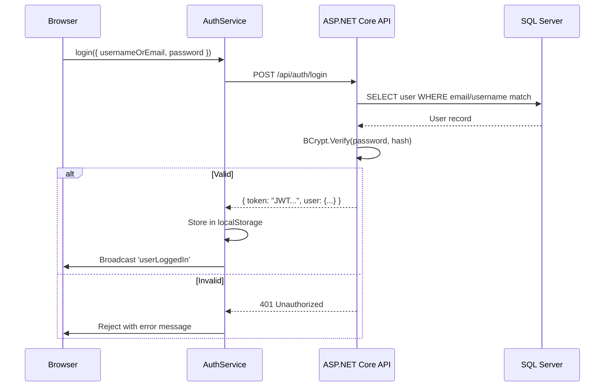

### Security Summary

| Mechanism | Detail |
|-----------|--------|
| **Passwords** | BCrypt hashed — never stored in plain text |
| **Session** | JWT stored in `localStorage`; included in every API request as `Authorization: Bearer <token>` |
| **RBAC (UI level)** | Functions `isPM()`, `isLead()`, `isDev()`, `isQA()` hide/show UI elements per role |
| **RBAC (API level)** | `[Authorize(Roles = "...")]` attributes on controllers reject unauthorized requests |
| **Soft Delete** | All entities implement `ISoftDelete` interface (`IsDeleted` flag) — nothing is permanently destroyed |
| **SignalR Auth** | Hub verifies JWT on connection; only pushes to authorized session users |

### SignalR Real-Time Events

| Event Name | Payload | Listener |
|-----------|---------|----------|
| `defectAssigned` | `{ defectId, title, controlId }` | Assigned developer's Notification Bell |
| `defectStatusChanged` | `{ defectId, title, status, controlId }` | Involved parties |
| `testCaseFailed` | `{ testCaseId, title }` | Related developer |
| `qaAssigned` | `{ description }` | Newly assigned QA engineer |

### Key API Routes

| Method | URL | Description |
|--------|-----|-------------|
| POST | `/api/auth/login` | Authenticate user |
| POST | `/api/auth/register` | Register new user |
| GET | `/api/controls?teamId=` | List controls for a team |
| POST | `/api/controls` | Create new control |
| PUT | `/api/controls/{id}` | Update control |
| GET | `/api/defects/by-control/{id}` | Get defects for a control |
| POST | `/api/defects` | Create defect |
| PUT | `/api/defects/{id}` | Update defect |
| GET | `/api/testcases/by-control/{id}` | Get test cases |
| POST | `/api/testcases` | Create test case |
| GET | `/api/progresslog/daily-summary` | Daily progress data |
| GET | `/api/progresslog/weekly-summary` | Weekly progress data |
| GET | `/api/teams/dashboard-stats` | Company-wide stats (Super Admin) |
| GET | `/api/activitylogs/by-control/{id}` | Activity log for a control |

---

## 22. Troubleshooting

| Problem | Likely Cause | Solution |
|---------|-------------|---------|
| **Cannot log in** | Wrong credentials or unregistered | Check username/email, verify account was registered by Admin |
| **"Register" link not visible** | Not an Admin role | Contact your system Admin or Project Manager |
| **Real-time notifications not arriving** | SignalR disconnected | Refresh the page; check browser console for WebSocket errors |
| **Controls not loading** | No team assigned | Ask your Admin to assign you to a team |
| **Defects modal shows nothing** | Right control, wrong sub-objective | Use the **Defects** button on the specific sub-objective TC row, not the control header |
| **Team Switcher not showing new team** | Cache not refreshed | Log out and log back in to see newly assigned teams |
| **Password reset** | No forgot-password flow | Use Profile page → Change Password (requires current password) |
| **Permission denied on action** | Role restricted | Check the Role Access Matrix in §7; ask Super Admin for override |
| **RC Matrix pie chart blank** | No test cases assigned | Assign test types during test case creation |

---

## 📎 Appendix — Defect Severity Reference

| Severity | Colour | Meaning |
|---------|--------|---------|
| 🔴 **Critical** | `#dc2626` | System crash, data loss, security breach — fix immediately |
| 🟡 **High** | `#f59e0b` | Major feature broken, no workaround — fix in current sprint |
| 🔵 **Medium** | `#3b82f6` | Feature degraded, workaround exists — fix in next sprint |
| 🟢 **Low** | `#10b981` | Minor cosmetic issue — fix when possible |

## 📎 Appendix — Sub-Objective Status Reference

| Status | Meaning | Owner Type |
|--------|---------|-----------|
| **Analyze** | Planning and design phase | Any |
| **Development** | Active coding in progress | Developer |
| **Dev Testing** | Developer self-testing | Developer |
| **Ready for QA** | Dev complete, handed to QA | Developer → QA |
| **QA** | Under QA testing | QA Engineer |
| **Completed** | All tests passed, done ✅ | Any |

---

##  Interactive Documentation Site

For the best documentation experience, open the interactive documentation website in your browser:

**[docs/index.html](index.html)** — Features:
- Live Mermaid diagrams (Architecture, ER, Class, Use Case, Workflow)
- Full permission matrix for all 11 roles with visual cards
- API reference with colour-coded HTTP methods
- Step-by-step setup and deployment guide
- Dark-mode interface with sidebar navigation

---

* This manual covers **all features** of Control App v2.0.  
For deployment setup and API documentation, refer to [README.md](../README.md).  
For the interactive documentation site with all diagrams, open [index.html](index.html) in your browser.  
For technical support, contact your System Administrator.*

*Last Updated: April 2026 — v2.0 | 11 User Roles | 26 Components | 50+ API Endpoints*
